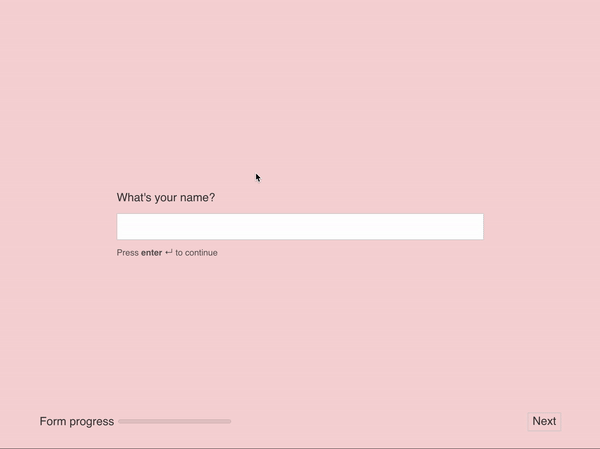

## About

A simple Typeform-esque single-question-per-screen form wizard.

Built with HTML, CSS (with Sass for preprocessing) and vanilla JS.

## Instructions

Parcel is used as bundler and build tool. Run a local server using ``` npm run serve ``` or ``` yarn serve ``` to load up the project.

## Demo
